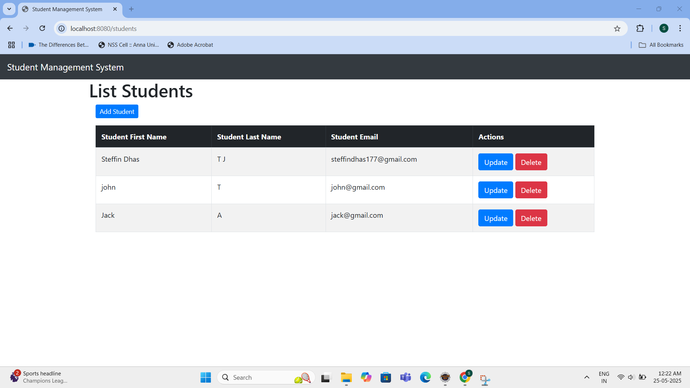
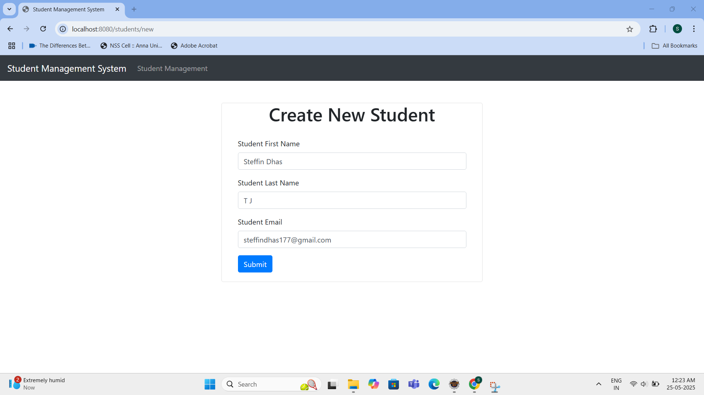
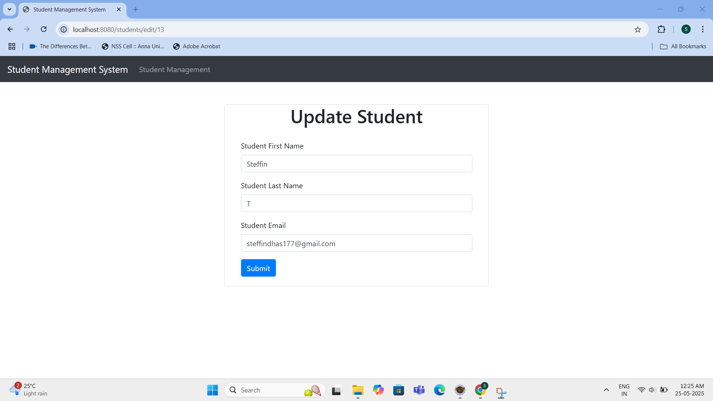
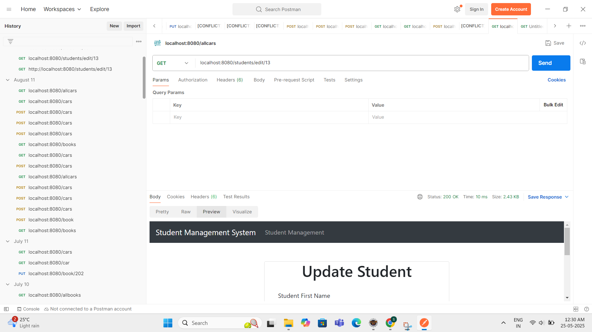

# Student Management System

A full-stack Student Management System web application built using **Spring Boot**, **Thymeleaf**, **HTML**, **CSS**, **JavaScript**, and **Postman** for backend API testing. The application allows users to **add**, **edit**, **view**, and **delete** student records through a clean UI and tested RESTful APIs.

---

## 🔍 Project Overview

This project is a CRUD-based web application using Spring Boot and Thymeleaf. It manages student data efficiently while following MVC architecture and demonstrates integration between frontend UI and backend RESTful services.

---

## ⚙️ Technologies Used

- **Backend**: Spring Boot, Spring MVC, Spring Data JPA, Hibernate  
- **Frontend**: Thymeleaf, HTML5, CSS3, JavaScript  
- **Database**: MySQL (or H2 for quick testing)  
- **API Testing**: Postman  
- **Build Tool**: Maven  
- **IDE**: VS Code / IntelliJ IDEA  

---

## ✅ Features

- Created 4 pages using Thymeleaf, HTML, CSS, and JavaScript:
  - Home Page
  - Add Student Page
  - Edit Student Page  
- RESTful APIs tested with **Postman**
- Add, update, view, and delete student records
- Responsive UI using Thymeleaf templates
- Exception handling and validation

---

## 📸 Output Screenshots

> _Note: Replace the images below with actual screenshots from your project._

### 1. Home Page  

### 2. Add Student  

### 3. Edit Students  

### 4. Postman API Testing  

---
